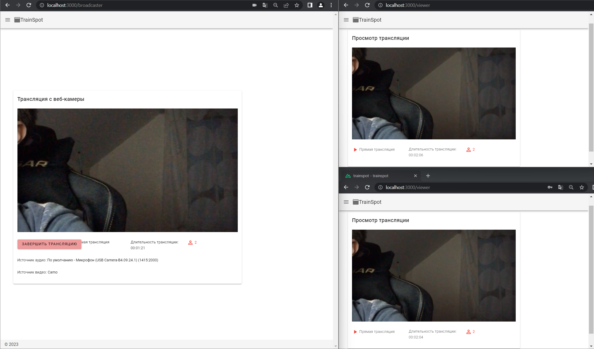

# WebRTC Video/Audio Broadcast

This [application](https://github.com/TannerGabriel/WebRTC-Video-Broadcast) was used as a signaling server. 
It also was a bit modificated

Here's an example how it looks like

## Getting started

### Starting the application

Start the application using Node:

```bash
# Install dependencies for server
npm install

# Run the server
node server
```

Start the application using Docker:

```bash
# Building the image
docker build --tag webrtcvideobroadcast .

# Run the image in a container
docker run -d -p 4000:4000 webrtcvideobroadcast
```